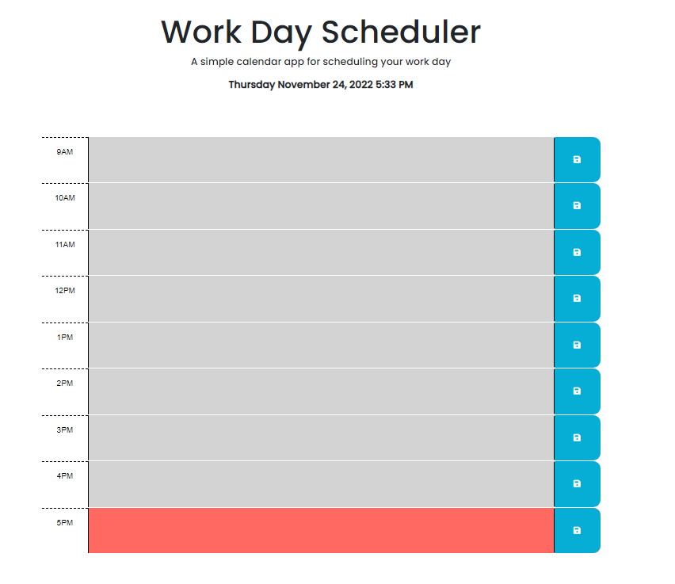

# Work-Day-Scheduler
## Description
This is a calendar application that allows a user to save events for each hour of the day. It was developed using HTML, CSS, Dayjs, Jquery and Javascript.

Below is how the application works:
 * When the planner is opened, the current day is displayed at the top of the calendar
 * When you scroll down, you are presented with timeblocks for standard business hours
 * When you view the timeblocks for that day, each timeblock is color-coded to indicate ehether it is in the past, present or future
 * When you click into a timeblock, you can enter an event
 * When you click the save button for that timeblock, the text for that event is saved in local storage
 * when you refresh the page, the saved events persist

## Installation
The URL of the deployed application is: https://buky-js.github.io/Work-Day-Scheduler/

You URL of the GitHub repository containing the code is: https://github.com/Buky-js/Work-Day-Scheduler

## Usage
You can download the code to the application from my Github account

## License
 This project is licensed under the MIT License.
